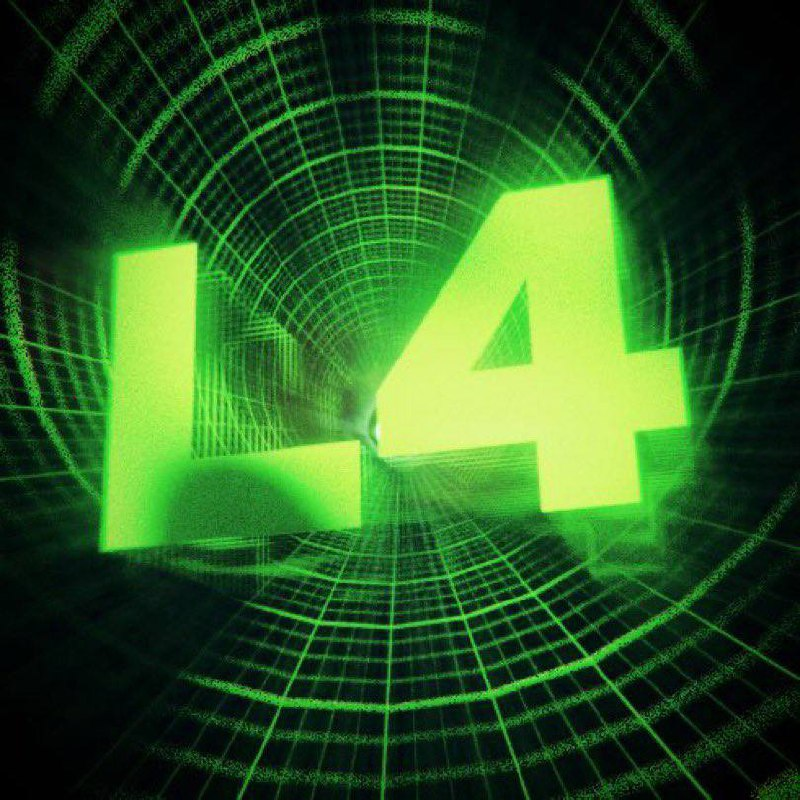

# Layer4 (L4) - Revolutionary Layer 4 Tek Protocol

## Overview
Layer4 (L4) is a groundbreaking blockchain protocol built on the fictional "Layer 4 Tek" technology. Designed for unbreakable financial stability, L4 enforces a strict "hold forever" mechanism where tokens can be acquired but never sold or transferred. This unique approach eliminates volatility, selling pressure, and community-driven hype, creating a truly stable and secure token.

## Whitepaper Summary
- **No Selling Allowed:** Tokens are locked in wallets via smart contracts preventing any sale or transfer.
- **No DEX Integration:** No decentralized exchanges or liquidity pools to tempt selling.
- **No Community:** No official channels or social media to avoid hype and dilution.
- **Technology:** Quantum-resistant hashing, self-destructing sell functions, and protocol-level bans on liquidity provision.
- **Tokenomics:** 1 billion L4 tokens, 100% distributed to initial buyers, no team or marketing allocation.

## Tech Stack
- **Frontend:** Next.js with React, TypeScript, and Tailwind CSS
- **Styling:** Custom vintage LisaStyle font and modern-vintage theme
- **Backend:** Node.js server (for API or other backend services)
- **Deployment:** Vercel or similar platforms for Next.js apps

## Instructions
1. Clone the repository.
2. Run `npm install` to install dependencies.
3. Use `npm run dev` to start the development server.
4. Access the app at `http://localhost:3000` (or the port specified).
5. Navigate to `/whitepaper` to view the full whitepaper content.

## Disclaimer
L4 is a satirical project emphasizing commitment to holding tokens forever. It is designed "by retards, for retards" as a humorous take on crypto culture and should be understood in that context.

---

For more details, refer to the full whitepaper in the `/whitepaper` page or the `whitepaper.txt` file.
